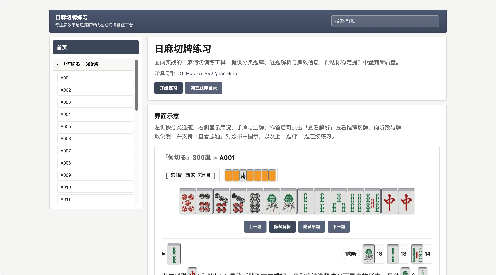

# nani-kiru

**日麻切牌练习（何切る Web）** — 面向实战的日本麻将「何切る」在线练习，提供分类题库、逐题解析与牌效信息，帮助提升中盘切牌判断质量。

### 界面预览



## 功能特性

- **分类题库**：支持多分类、多题目，左侧目录可折叠浏览，顶部支持标题搜索
- **牌面展示**：基于图集（atlas）渲染牌面，展示稳定、加载开销低
- **解析与牌效**：每题提供标准切牌、向听数、牌效率（eff）及解析文案；解析中支持 `[牌码]` 内嵌牌图
- **连续练习**：进入题目后可「上一题 / 下一题」在同一分类内连续训练

## 技术栈

- **框架**：React 18 + TypeScript
- **构建**：Vite 5
- **数据**：静态 JSON（`public/data/`），一题一文件，构建时生成分类索引与题目列表

## 环境要求

- Node.js（建议 18+）
- npm

## 快速开始

```bash
# 安装依赖
npm install

# 校验题库（可选，确保数据无误）
npm run validate:problems

# 刷新题目索引（若修改过题目文件）
npm run build:problems

# 本地开发
npm run dev
```

浏览器访问开发服务器地址（通常为 `http://localhost:5173`）。

## 脚本说明

| 命令                          | 说明                                                                   |
| ----------------------------- | ---------------------------------------------------------------------- |
| `npm run dev`               | 启动 Vite 开发服务器                                                   |
| `npm run build`             | 生产构建，输出到 `dist/`                                             |
| `npm run preview`           | 预览生产构建结果                                                       |
| `npm run add:category`      | 添加分类，见下方「题库管理」                                           |
| `npm run add:problem`       | 添加题目（推荐），见[添加题目说明](docs/添加题目说明.md)                  |
| `npm run validate:problems` | 校验所有题目 JSON 与分类配置                                           |
| `npm run build:problems`    | 根据 `problems/` 重新生成 `titles.json` 与 `problems.index.json` |

## 题库管理

- **数据目录**：`public/data/`
- **分类配置**：`public/data/categories.json`
- **题目文件**：`public/data/categories/<分类id>/problems/<题目id>.json`
- **题目列表**：每分类下 `titles.json` 由脚本维护或通过 `npm run build:problems` 生成

### 添加分类

```bash
npm run add:category -- --id <分类id> --title "<分类显示名>"
# 示例
npm run add:category -- --id efficiency --title "门清效率"
```

### 添加题目

推荐使用脚本（必填参数见 [添加题目说明](docs/添加题目说明.md)）：

```bash
npm run add:problem -- \
  --category <分类id或标题> \
  --title "<题目名>" \
  --round "<局数>" \
  --seat <自风> \
  --turn <巡目> \
  --dora "<宝牌>" \
  --hand "<14张手牌>" \
  --answer "<切牌>" \
  --shanten <向听> \
  --eff "<牌:数值,...>" \
  --reasoning "<解析>"
```

也可手动在对应分类的 `problems/` 下新建 JSON 文件，并执行 `npm run build:problems` 刷新索引。

## 项目结构（简要）

```
.
├── public/
│   ├── data/                 # 题库数据
│   │   ├── categories.json   # 分类列表
│   │   ├── problems.index.json
│   │   └── categories/<id>/
│   │       ├── titles.json
│   │       └── problems/*.json
│   └── assets/               # 牌面图集等静态资源
├── src/
│   ├── App.tsx               # 主应用（首页 + 练习页）
│   ├── main.tsx
│   ├── styles.css
│   ├── components/           # Tile, TileRow 等
│   └── lib/                  # tileAtlas 等工具
├── scripts/                  # 题库相关脚本
│   ├── add-category.mjs
│   ├── add-problem.mjs
│   ├── validate-problems.mjs
│   ├── build-problems.mjs
│   └── problem-utils.mjs
├── docs/
│   └── 添加题目说明.md       # 题目添加与牌码规则详解
├── package.json
├── tsconfig.json
└── index.html
```

## 牌码与数据格式

- **万/筒/索**：`1m`–`9m`、`1p`–`9p`、`1s`–`9s`
- **字牌**：`east` / `south` / `west` / `north` / `white` / `green` / `red`
- **背面**：`back`

题目 JSON 字段包括：`id`、`category_id`、`title`、`round_label`、`seat_wind`、`turn`、`dora`、`hand_tiles`、`answer_discard`、`shanten`、`tile_efficiency`、`reasoning` 等，详见 `public/data/categories/*/problems/` 下示例与 [添加题目说明](docs/添加题目说明.md)。

## 补充说明

### 数据来源

本仓库中「何切る」题目思路与内容源自书籍 **《麻雀 傑作「何切る」300選》**（G・ウザク）。本项目为爱好者自建练习工具，与原作者及出版社无关联。

**请支持原版**：有条件的朋友欢迎购买正版书籍，以支持作者与出版方。

- 日亚链接：[麻雀 傑作「何切る」300選 - G・ウザク](https://www.amazon.co.jp/%E9%BA%BB%E9%9B%80-%E5%82%91%E4%BD%9C%E3%80%8C%E4%BD%95%E5%88%87%E3%82%8B%E3%80%8D300%E9%81%B8-G%E3%83%BB%E3%82%A6%E3%82%B6%E3%82%AF/dp/4861998948)

### 牌面来源

项目内使用的牌面图（手牌、宝牌等牌图资源）来源声明：[雀魂 DB - 牌面·默認](https://mahjongsoul.club/inventory/%E7%89%8C%E9%9D%A2-%E9%BB%98%E8%AA%8D?language=zh-hant)（普通の図柄）。牌面版权归原权利方所有，本项目仅作学习与练习用途，与雀魂 / Mahjong Soul 官方无关联。

### 翻译说明

题目解析等日文内容的**中文翻译由 AI 辅助完成**，可能存在用词或理解偏差。若发现错误或更好的译法，欢迎通过 Issue 或 Pull Request 指出与修改。

### 免责声明

- 本仓库仅供学习与个人练习使用，不涉及任何商业用途。
- 题目与解析仅供参考，不构成教学、竞技或实战建议；使用本工具产生的任何结果由使用者自行承担。
- 本项目与《麻雀 傑作「何切る」300選》之作者、出版社无关，未获其授权；原书版权归原作者与出版方所有。

## License

[MIT](LICENSE)
